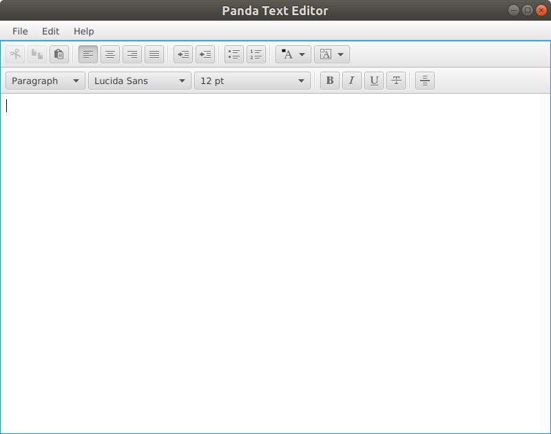

  

Welcome to Panda Text Editor
========================

 - A text editor is a type of program used for editing plain text files. Such programs are known as "notepad" software, following the Microsoft Notepad. Text editors are provided with operating systems and software development packages, and can be used to change configuration files, documentation files and programming language source code. 

 - In this project we design a text editor which used for editing encrypted text files and works on Linux platform.We called this text editor as “Panda Text Editor”. We used  Java and Java FX programs for this project. 

----------
Run
----------
> - NetBeans IDE 8.2

> - Java 1.8.0_111

> - Ubuntu 18.04.03 LTS

> - Windows 10

-----------

Features
-------------

The most important features of the software Panda Text Editor, ease of use, functional and user-friendly interface.

> - Open Encrypted Files
> - Save To Folder
> - New File
> - Save to FTP
> - Encryption - Decryption
> - Print File

